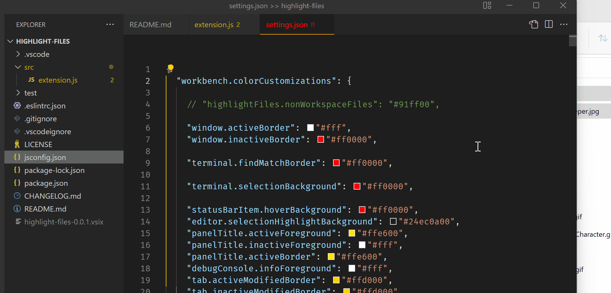

# highlight-files

This vscode extension will highlight the editor tab of any file opened that is not part of the workspace.  The tab will be have a unique color which can configure.  Both the editor tab label and the filename in the Explorer will get this color.  



The color used is a `ThemeColor` called `highlightFiles.nonWorkspaceFiles` and defaults to a lime green or `#91ff00`.  That may not work in the theme you use for your editor so it is configurable.  In your `settings.json` add this `colorCustomiztion`:  

```jsonc
  "workbench.colorCustomizations": {
    
    "highlightFiles.nonWorkspaceFiles": "#91ff00"  // a wonderful lime green, the default
  }
```

Any hex color can be used including those with opacity like `#91ff0060`: the last two digits are for opacity.  

## Known Issues

* After installing the extension, you may have to reload vscode 1x or 2x to activate this extension.  

To enable the editor color and badges the following two settings must be enabled - they control all file color decorations whatever the source:  

```jsonc
  Workbench > Editor > Decorations: Badges  
  // Controls whether editor file decorations should use badges.  
  "workbench.editor.decorations.badges": true,

  Workbench > Editor > Decorations: Colors  
  // Controls whether editor file decorations should use colors.  
  "workbench.editor.decorations.colors": true,
```

To enable the file explorer color and badges these settings must be enabled:  
  
```jsonc
  Explorer > Decorations: Badges  
  // Controls whether file decorations should use badges.  
  "explorer.decorations.badges": true,

  Explorer > Decorations: Badges  
  // Controls whether file decorations should use colors.  
  "explorer.decorations.colors": true,
```

------------

This setting `Problems > Decorations: Enabled` will take precedence over the file decorations of this extension.  So, if this setting is enabled even a non-workspace file, if it has problems in it, will be colored according to whatever the Problems decorations color is and not what this extension's `highlightFiles.nonWorkspaceFiles` color setting.  There is no way to avoid that precedence of the `Problems` decoration other than disabling the following setting:  

```jsonc
  Problems > Decorations: Enabled
  // Show Errors & Warnings on files and folder.
  "problems.decorations.enabled": true,
```
  
------------

## Contributed Setting  

This extension contributes one setting:

```jsonc
Highlight-files: Enable  in the Settings UI

"highlight-files.enable": true/false   in settings.json, default is false
```

The default is `false`, so you will have to opt-in to enable the extension and start coloring tab names.  You can change the setting at any time and it should take effect immediately.  

------------

## Release Notes

* 0.0.3 Ignore uri.scheme === 'vscode-userdata' so `settings.json` and `keybindings.json` are not decorated  

* 0.0.4 Added `Highlight-files: Enable` setting
